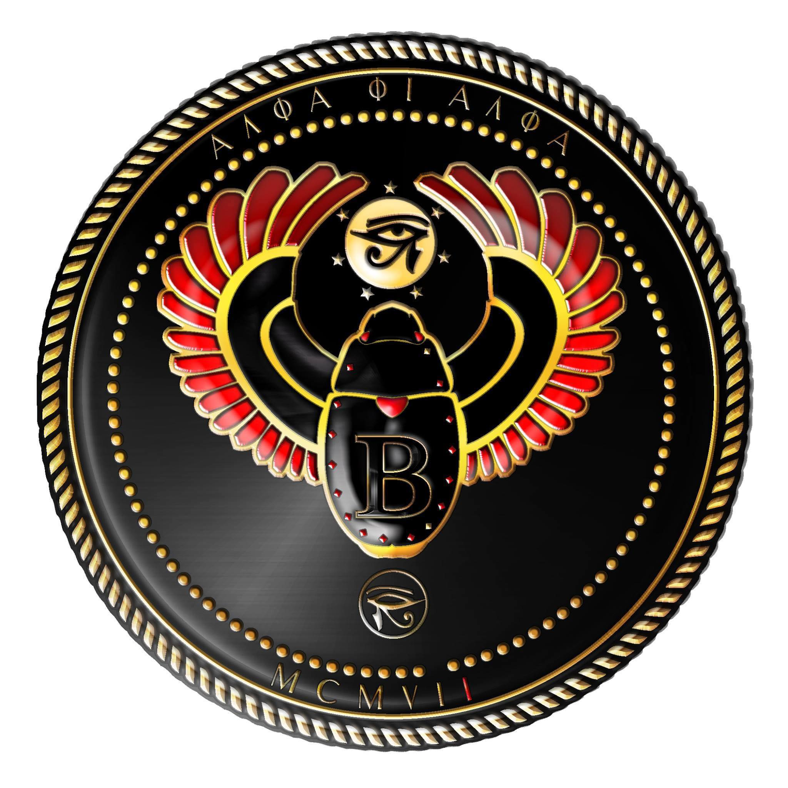

# 🚀 Alpha Phi Alpha AI Learning Path
## "Learning AI, Together" - Beta Chapter

**Created by Sean Gayle, Beta '91**

Welcome, Brothers. This repository contains everything you need to master AI tools and leverage them for career growth, business scaling, and competitive advantage.

---

## 📁 What's Inside

### 📖 Learning Materials
- **[`LEARNING_PLAN.md`](LEARNING_PLAN.md)** - The complete 4-week AI learning curriculum with video links and structured phases
- **[`alpha_learning_flowchart.svg`](alpha_learning_flowchart.svg)** - Visual flowchart showing your learning journey from start to mastery
- **[`alpha_learning_flowchart.mmd`](alpha_learning_flowchart.mmd)** - Mermaid diagram version (can be rendered on GitHub)
- **[`QUICK_REFERENCE.md`](QUICK_REFERENCE.md)** - Quick reference guide for AI tools and workflows

### 🎯 Quick Start
1. Start with [`LEARNING_PLAN.md`](LEARNING_PLAN.md)
2. Follow the 4 phases in order
3. Complete the assignment in Week 4
4. Share your results with your brother

---

## 🎓 The Path: 4 Weeks to AI Mastery

### Phase 1: Understand the Power (Week 1)
- Learn Perplexity basics for market research
- Understand NotebookLM for data synthesis
- Discover how these tools work together

### Phase 2: See the Full Picture (Week 1-2)
- Master the 8 AI workflows that actually work
- Learn how to chain tools together
- Identify workflows for YOUR business

### Phase 3: Master Perplexity (Week 2-3)
- Deep dive into advanced research techniques
- Learn strategic prompting
- Build competitive analysis skills

### Phase 4: Put It to Work (Week 3-4)
- Understand automation at scale
- Learn to go from "research" to "action"
- Free up your time for strategic thinking

---

## 🎯 Your Assignment

After 4 weeks, you'll pick ONE workflow that matches your business needs and run a real experiment. This isn't theory—it's about building the skill to think strategically WITH AI as your team.

---

## 💰 The ROI

- **Cost**: Free to start, ~$20/month for premium tools
- **Time Investment**: ~4 hours per week for 4 weeks
- **Return**: A competitive advantage that most people won't have for years

---

## 👥 Community

This is a Beta Chapter initiative led by Sean (@msftsean), Director of AI Engineering at Microsoft. Share your progress, ask questions, and help your brothers level up.

---

## 🔗 Key Resources

- **Perplexity**: https://www.perplexity.ai
- **NotebookLM**: https://notebooklm.google.com
- **Claude**: https://claude.ai
- **Gemini**: https://gemini.google.com

---

## ✅ Completion Checklist

- [ ] Watch Phase 1 videos (Week 1)
- [ ] Watch Phase 2 videos (Week 1-2)
- [ ] Take notes on workflows
- [ ] Watch Phase 3 videos (Week 2-3)
- [ ] Watch Phase 4 videos (Week 3-4)
- [ ] Pick ONE workflow
- [ ] Run your experiment
- [ ] Document results
- [ ] Share with your brother

---

## 📞 Questions?

Message your brother. This is a fraternity initiative—we're in this together.

---

---

## 📊 Project Status

### Learning Path Progress

| Phase | Content | Status | Duration |
|-------|---------|--------|----------|
| 📖 Phase 1 | Understand the Power | ✅ Complete | Week 1 |
| 🔄 Phase 2 | See the Full Picture | ✅ Complete | Week 1-2 |
| 🎯 Phase 3 | Master Perplexity | ✅ Complete | Week 2-3 |
| 🚀 Phase 4 | Put It to Work | ✅ Complete | Week 3-4 |

---

## 📋 Revision Matrix

| Version | Date | Changes | Author |
|---------|------|---------|--------|
| 1.0 | Dec 20, 2025 | Initial release with complete 4-week curriculum | Sean Gayle, Beta '91 |
| 1.0 | Dec 20, 2025 | Added Beta Chapter logo and documentation links | Sean Gayle, Beta '91 |
| 1.0 | Dec 20, 2025 | Added status bars and revision matrix | Sean Gayle, Beta '91 |

---

## 💝 Inspiration

This learning path was created with love and fraternity, inspired by a Zoom call celebrating the **118th Anniversary of the Chartering of the Beta Chapter of Alpha Phi Alpha Fraternity, Inc.** on December 20th, 2025.

To my brothers: May this resource help you harness the power of AI to build stronger businesses, serve our communities more effectively, and continue our legacy of excellence.

**"First of All, Servants of All, We Shall Transcend All"**

---

*For questions, updates, or contributions, contact Sean Gayle (Beta '91) at [@msftsean](https://github.com/msftsean)*
---

**Alpha Phi Alpha Fraternity, Inc.**
**Beta Chapter**
**"First of All, Servants of All, We Shall Transcend All"** 🤝🏆

*Last Updated: December 20, 2025*
